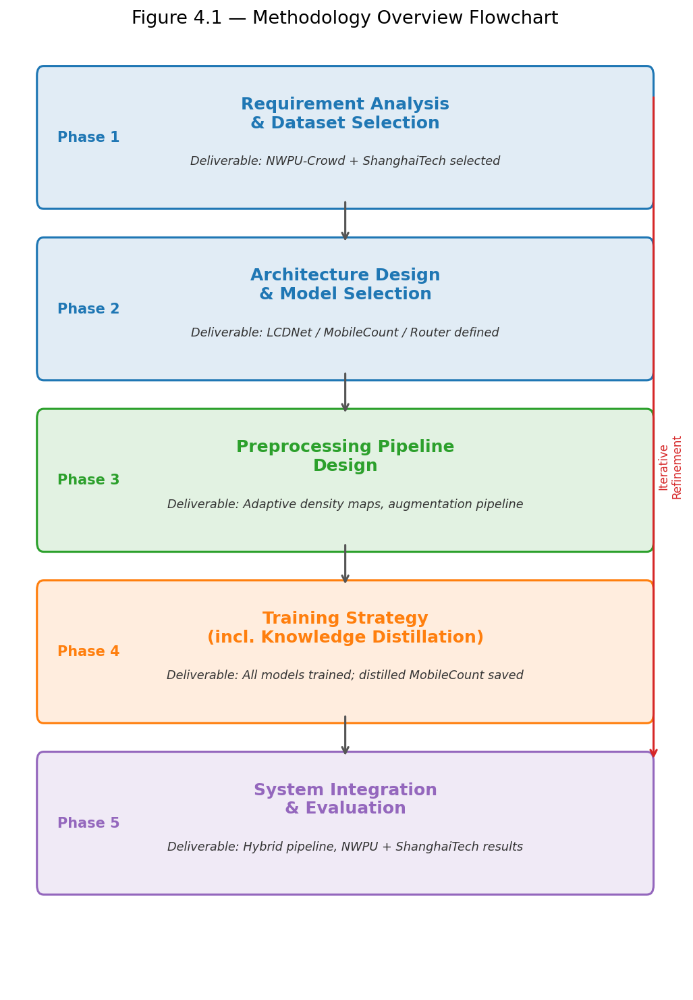
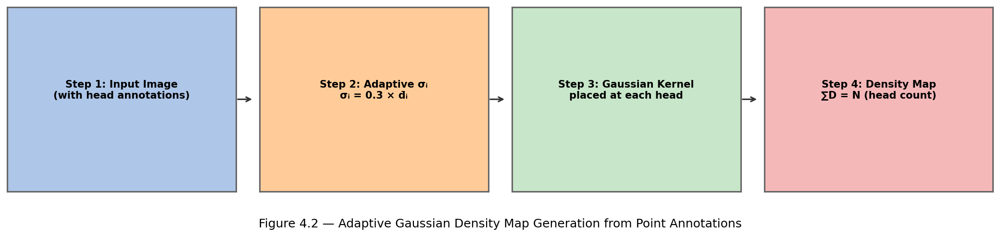
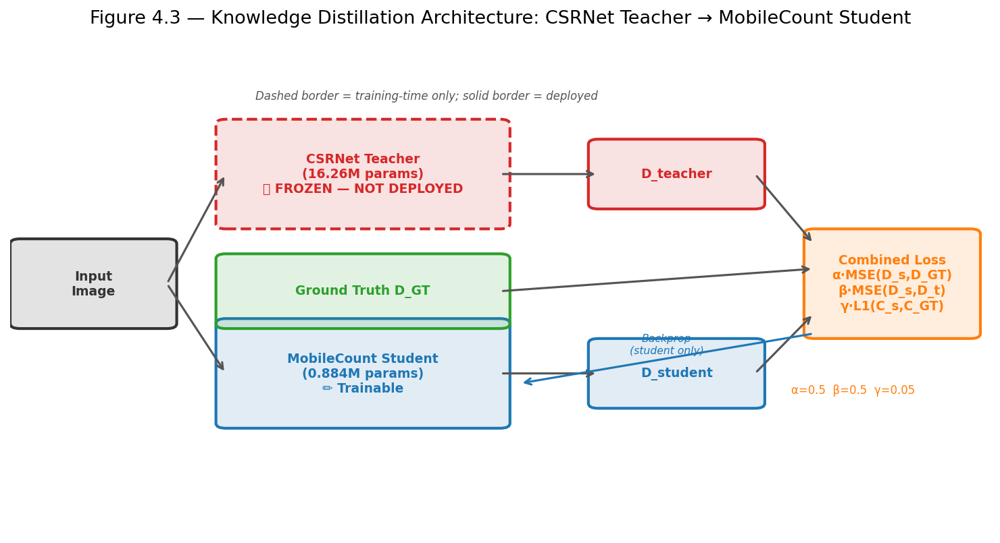
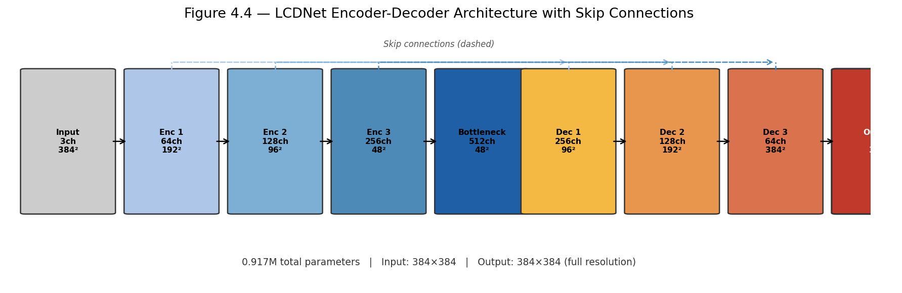
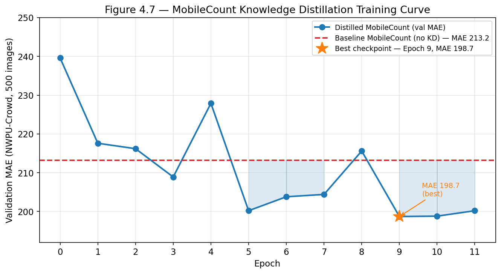
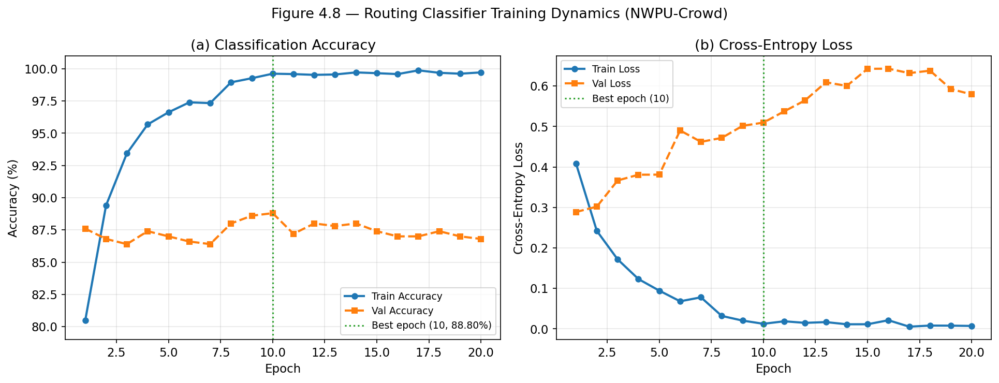

# Chapter 4: Proposed Methodology

## 4.1 Design Process and Methodology Overview

The hybrid crowd density estimation system was developed through a structured five-stage design process, in which each stage addresses a specific research objective and builds progressively upon the insights gained in the preceding stage. This systematic methodology ensures that design decisions are made on an empirical basis, validated against established research objectives at each transition between phases. The overall design process is illustrated in Figure 4.1.

---

**Figure 4.1 — Methodology Overview Flowchart.** Five-phase design process from requirement analysis through system integration, with iterative refinement feedback from evaluation back to requirements.

---

### 4.1.1 Phase 1: Requirement Analysis and Dataset Selection

The preliminary phase of the research methodology was concentrated on developing a thorough understanding of the problem space and identifying appropriate datasets to support the training and evaluation of the proposed system. The selection criteria were designed to ensure that the chosen datasets reflect the diversity and complexity of real-world crowd monitoring scenarios.

Based on the deployment constraints and the scope of the problem, a number of system requirements were established. The proposed system must be capable of producing accurate density estimates across a wide range of crowd densities, including sparse scenarios with fewer than 100 people and extreme-density scenarios exceeding 5,000. Beyond accuracy, the system must be computationally efficient, enabling inference at a throughput compatible with edge hardware such as the NVIDIA Jetson Nano. Privacy-preserving operation requires that all processing be performed on-device, without transmitting raw video frames to centralised servers. Furthermore, the architecture must be modular and scalable, permitting deployment across networks of cameras without prohibitive increases in computational overhead.

**Selected Datasets:**
- **NWPU-Crowd [Wang et al., 2020]:** 5,109 images, 2,133,375 head annotations, crowd counts ranging from 0 to 20,033 per image. Selected as the primary training and evaluation benchmark for all three deployed model components.
- **ShanghaiTech Part A [Zhang et al., 2016]:** 482 images (300 train, 182 test), 241,677 annotations, counts ranging from 33 to 3,139. Used exclusively for cross-dataset generalisation evaluation.
- **ShanghaiTech Part B [Zhang et al., 2016]:** 716 images (400 train, 316 test), 88,488 annotations, counts ranging from 9 to 578. Also reserved for cross-dataset generalisation evaluation.

No samples from ShanghaiTech Part A or Part B are used in any stage of training, validation, or hyperparameter selection; these datasets serve exclusively to evaluate zero-shot generalisation.

---

### 4.1.2 Phase 2: Architecture Design and Model Selection

Following requirements analysis, the architecture design phase addressed the fundamental accuracy-efficiency trade-off by introducing a hybrid architecture capable of adaptive model selection based on the complexity of the input scene.

**Component 1: LCDNet (Lightweight Crowd Density Network).** Designed for sparse-to-medium density scenes (ground-truth count ≤ 100). The architecture employs an encoder-decoder topology with depthwise separable convolutions, achieving approximately 8× fewer parameters than standard convolutional architectures of equivalent depth, while maintaining sufficient representational capacity. Skip connections link encoder and decoder stages, preserving fine-grained spatial information. LCDNet produces full-resolution density maps matching the input spatial dimensions.

**Component 2: MobileCount (Deployed Dense Specialist — Knowledge-Distilled).** Designed for dense crowd scenes (ground-truth count > 100). Employs the first 13 feature layers of a pretrained MobileNetV2 backbone as the encoder, three dilated convolution context blocks (dilation rate = 2) for multi-scale contextual information, and a skip-connection fusion module combining encoder representations at two resolution scales. The output is a 1/8-resolution density map; crowd count is obtained by spatial summation. MobileCount is deployed in knowledge-distilled form — trained to match the density outputs of a CSRNet teacher. The teacher is discarded after distillation and is never part of the deployed pipeline.

**Component 3: CSRNet (Knowledge Distillation Teacher — Not Deployed).** Used exclusively as a training-time teacher. Consists of the first ten convolutional layers of VGG-16 as pretrained frontend and six dilated convolutional layers (dilation rates: 2, 2, 2, 4, 4, 4) as the backend. Its 16.26M parameters make it unsuitable for edge deployment; however, its superior dense-scene density estimation capability is transferred to MobileCount through distillation.

**Component 4: MobileNetV2 Routing Classifier.** A pretrained MobileNetV2 backbone with a custom two-class fully connected head classifying each input as sparse (count ≤ 100) or dense (count > 100). The routing threshold T = 100 is consistent with established crowd counting literature.

---

### 4.1.3 Phase 3: Preprocessing Pipeline

**Stage 1: Density Map Generation.**

Ground-truth density maps are synthesised by placing adaptive Gaussian kernels at annotated head positions. The standard deviation σᵢ of the kernel at annotation i is:

σᵢ = β · d̄ᵢ

where d̄ᵢ is the mean Euclidean distance from head position i to its k = 3 nearest neighbours, and β = 0.3 is the empirically calibrated scaling coefficient. This adaptive formulation produces narrower kernels in congested regions and wider kernels in sparse regions. Mass conservation is enforced: ∬D(x,y)dxdy = N, enabling pixel-wise regression. A fixed fallback sigma of 15.0 pixels is applied when only a single head is annotated. All sigma values are clipped to [4.0, 30.0] pixels.

**Stage 2: Data Augmentation.** Applied stochastically during training, identically to image and density map: (1) random horizontal flip (p=0.5); (2) random 384×384 patch crop from 512×512 rescaled image (p=0.3); (3) brightness ±20%, contrast ±20%, saturation ±20%, hue perturbation.

**Stage 3: Normalisation.** All images normalised using ImageNet statistics (mean: [0.485, 0.456, 0.406]; std: [0.229, 0.224, 0.225]).

---

**Figure 4.2 — Adaptive Gaussian Density Map Generation from Point Annotations.** Four-stage pipeline: (1) raw crowd image with head annotations, (2) adaptive kernel width computation σᵢ = 0.3 × d̄ᵢ, (3) Gaussian kernel placement, (4) final density heatmap with ∑D = N.

---

### 4.1.4 Phase 4: Training Strategy Design

**LCDNet Training.** Trained from random initialisation on the NWPU-Crowd sparse training subset (count ≤ 100). Loss: pixel-wise MSE. Optimiser: Adam (lr = 1×10⁻⁴, weight decay = 1×10⁻⁵). Scheduler: ReduceLROnPlateau (factor = 0.5, patience = 15). Up to 100 epochs; early stopping after 50 without improvement. Gradient clipping at max norm 5.0.

**MobileCount Baseline Training.** Trained on the full NWPU-Crowd training set with direct MSE supervision on 1/8-resolution density maps. Optimiser: Adam (lr = 1×10⁻⁴). Scheduler: cosine annealing. This baseline checkpoint serves as the warm-start initialisation for knowledge distillation.

**Knowledge Distillation — CSRNet Teacher to MobileCount Student.** The combined distillation loss is:

L_distill = α · MSE(D_student, D_GT) + β · MSE(D_student, D_teacher) + γ · L1(C_student, C_GT)

where D_student and D_teacher are student and teacher density map outputs, D_GT is the ground-truth density map, C_student is the predicted count, C_GT is the ground-truth count, and α = 0.5, β = 0.5, γ = 0.05. The student is optimised with AdamW (lr = 5×10⁻⁵, weight decay = 1×10⁻⁴) with cosine annealing (η_min = 1×10⁻⁷) for 12 epochs. Gradient clipping at max norm 1.0. Teacher parameters are frozen (requires_grad = False). The checkpoint with the lowest validation MAE is retained; the teacher is discarded.

**Routing Classifier Training.** Fine-tuned from pretrained MobileNetV2 using binary cross-entropy loss. Custom head: Dropout(0.3) → Linear(1280→256) → ReLU → Dropout(0.3) → Linear(256→2). Optimiser: Adam (lr = 1×10⁻⁴, weight decay = 1×10⁻⁵). Up to 25 epochs; early stopping after 10 without validation accuracy improvement.

---

**Figure 4.3 — Knowledge Distillation Architecture.** The frozen CSRNet teacher (16.26M params, dashed border — training only, not deployed) generates D_teacher. The trainable MobileCount student (0.88M params, solid border) generates D_student. Three loss terms — α·MSE(D_student, D_GT), β·MSE(D_student, D_teacher), γ·L1(C_student, C_GT) — are combined; gradients flow only to the student. After training, the teacher is discarded entirely.

---

### 4.1.5 Phase 5: System Integration and Evaluation

**Performance Measures:**
- **MAE:** Mean absolute error between predicted and ground-truth counts; primary accuracy metric.
- **RMSE:** Root mean squared error; penalises large individual errors.
- **Inference Latency:** Per-image time in ms; measured on RTX 3050 after 30 warmup passes, averaged over 30 evaluation runs.
- **Routing Accuracy:** Fraction of correctly classified images (sparse vs. dense) on NWPU-Crowd val.
- **95% Bootstrap Confidence Intervals:** 2,000-iteration bootstrap resampling on the 500-image validation set.

**Integration Architecture.** All three deployed components are assembled in the `HybridDensityEstimator` class. Each input image is forwarded to the router at 224×224 to produce [P(sparse), P(dense)]. If P(dense) ≥ p*, the image is forwarded to MobileCount at 384×384; otherwise to LCDNet at 384×384. The routing threshold p* is optimised post-hoc by sweeping 17 candidate values on the validation set, identifying p* = 0.85 as the optimal operating point.

---

## 4.2 Preliminary Design and Model Specification

### 4.2.1 Dataset Characteristics

**Table 4.1 — Dataset Statistical Characteristics**

| Characteristic | ShanghaiTech Part A | ShanghaiTech Part B | NWPU-Crowd |
|---|---|---|---|
| Total Images | 482 | 716 | 5,109 |
| Total Annotations | 241,677 | 88,488 | 2,133,375 |
| Training Images | 300 | 400 | 3,109 |
| Validation Images | — | — | 500 |
| Test Images | 182 | 316 | 1,500 |
| Min Crowd Count | 33 | 9 | 0 |
| Max Crowd Count | 3,139 | 578 | 20,033 |
| Mean Count | 501.4 | 123.6 | 417.5 |
| Std. Deviation | 389.2 | 90.4 | 791.4 |
| Image Resolution | Variable (~768×1024) | Variable (~768×1024) | Variable (~2,191×3,209) |
| Usage in this work | Cross-dataset eval only | Cross-dataset eval only | Primary (all components) |

---

### 4.2.2 LCDNet Architecture Specification

LCDNet employs an encoder-decoder architecture with symmetric skip connections. Four encoder stages apply progressive downsampling, each containing two depthwise separable convolution (DSConv) layers — depthwise conv + pointwise (1×1) conv + BN + ReLU — followed by MaxPool2×2. The bottleneck (Stage 4) omits pooling. Each decoder stage applies bilinear upsampling, skip connection concatenation, and two DSConv refinement layers. The output head produces a single-channel, full-resolution density map via Conv3×3(64→32) + ReLU + Conv1×1(32→1) + ReLU.

**Table 4.2 — LCDNet Detailed Layer-wise Specification**

| Component | Layer Configuration | Dimensionality Transform | Parameters | Functional Role |
|---|---|---|---|---|
| **Encoder Stage 1** | DSConv×2 + MaxPool2×2 | 384×384×3 → 192×192×64 | ~3,500 | Primary feature extraction |
| **Encoder Stage 2** | DSConv×2 + MaxPool2×2 | 192×192×64 → 96×96×128 | ~17,000 | Intermediate representations |
| **Encoder Stage 3** | DSConv×2 + MaxPool2×2 | 96×96×128 → 48×48×256 | ~66,000 | Mid-level semantic features |
| **Encoder Stage 4 (Bottleneck)** | DSConv×2 (no pool) | 48×48×256 → 48×48×512 | ~264,000 | High-level abstractions |
| Dropout2D (p=0.2) | Regularisation | 48×48×512 | 0 | Prevent overfitting |
| **Decoder Stage 1** | Upsample + Concat + DSConv×2 | 48×48×512 → 96×96×256 | ~396,000 | Initial spatial reconstruction |
| **Decoder Stage 2** | Upsample + Concat + DSConv×2 | 96×96×256 → 192×192×128 | ~99,000 | Intermediate upsampling |
| **Decoder Stage 3** | Upsample + Concat + DSConv×2 | 192×192×128 → 384×384×64 | ~25,000 | Fine-grained reconstruction |
| **Output Head** | Conv3×3(64→32) + ReLU + Conv1×1(32→1) + ReLU | 384×384×64 → 384×384×1 | ~18,500 | Density map generation |
| **Total** | — | — | **≈0.917M** | Full-resolution output |

*DSConv = Depthwise Conv + Pointwise Conv + BN + ReLU. Skip connections concatenate pre-pool encoder features with upsampled decoder features at each resolution.*

---

**Figure 4.4 — LCDNet Encoder-Decoder Architecture with Skip Connections.** Channel depth and spatial resolution at each stage are labelled. Dashed arrows indicate skip connections from encoder to decoder. Total deployed parameters: 0.917M; output resolution matches input (384×384).

---

### 4.2.3 MobileCount Architecture Specification

MobileCount uses the first 13 MobileNetV2 feature layers as encoder. Stage 1 (features[0:7]) outputs 1/8-resolution, 32-channel features — retained as the skip connection. Stage 2 (features[7:14]) outputs 1/16-resolution, 96-channel features. Three dilated context blocks (Conv3×3, dilation=2, 96→96 channels each) extract multi-scale context. Features are 2× upsampled, concatenated with the Stage 1 skip (32ch + 96ch = 128ch), and passed through a fusion block (Conv3×3 128→64, Conv3×3 64→32). A 1×1 output head produces the 1/8-resolution density map (48×48 for 384×384 input).

**Table 4.3 — MobileCount Architecture Specification**

| Component | Configuration | Output Shape | Notes |
|---|---|---|---|
| Input | RGB image | B×3×384×384 | Standard resolution |
| **Encoder Stage 1** (features[0:7]) | MobileNetV2 inverted residuals | B×32×48×48 | Stride 8; skip connection source |
| **Encoder Stage 2** (features[7:14]) | MobileNetV2 inverted residuals | B×96×24×24 | Stride 16 |
| **Dilated Context Block 1** | Conv3×3(96→96, dilation=2) + BN + ReLU | B×96×24×24 | Multi-scale context |
| **Dilated Context Block 2** | Conv3×3(96→96, dilation=2) + BN + ReLU | B×96×24×24 | Expanded receptive field |
| **Dilated Context Block 3** | Conv3×3(96→96, dilation=2) + BN + ReLU | B×96×24×24 | — |
| Bilinear Upsample ×2 | — | B×96×48×48 | Match Stage 1 resolution |
| **Concat** (skip + upsampled) | — | B×128×48×48 | 32ch + 96ch |
| **Fusion Block** | Conv3×3(128→64)+BN+ReLU + Conv3×3(64→32)+BN+ReLU | B×32×48×48 | Feature integration |
| **Output Head** | Conv1×1(32→1) + ReLU | B×1×48×48 | Density map (1/8 res) |
| **Total Parameters** | — | — | **≈0.884M** |

*Count = sum(density_map). Deployed in knowledge-distilled form (see §4.1.4). Inference: 3.4 ms GPU, 13.5 ms CPU.*

**Table 4.4 — CSRNet Teacher Architecture Reference (Training Only — Not Deployed)**

| Component | Layer Configuration | Dimensionality Transform | Parameters | Status |
|---|---|---|---|---|
| Frontend VGG Block 1–2 | 2×Conv3-64, Pool, 2×Conv3-128, Pool | 384×384×3 → 96×96×128 | 260,160 | ImageNet pretrained |
| Frontend VGG Block 3 | 3×Conv3-256, Pool | 96×96×128 → 48×48×256 | 1,475,328 | ImageNet pretrained |
| Frontend VGG Block 4–5 | 6×Conv3-512 | 48×48×256 → 48×48×512 | 12,979,200 | ImageNet pretrained |
| Backend Dilated 1–3 | 3×Conv3-512 (dilation=2) | 48×48×512 → 48×48×512 | 7,079,424 | Randomly init |
| Backend Dilated 4–6 | Conv3-256, Conv3-128, Conv3-64 (dilation=4) | 48×48×512 → 48×48×64 | 1,548,736 | Randomly init |
| Output | 1×1 Conv + ReLU | 48×48×64 → 48×48×1 | 65 | Randomly init |
| **Total** | — | — | **16,263,489** | **Not deployed — KD teacher only** |

---

### 4.2.4 Routing Classifier Specification

The routing classifier uses the full MobileNetV2 backbone (pretrained on ImageNet) with a custom 2-class head:

Dropout(p=0.3) → Linear(1280→256) → ReLU → Dropout(p=0.3) → Linear(256→2)

Softmax produces [P(sparse), P(dense)]. Route to MobileCount if P(dense) ≥ p*; to LCDNet if P(dense) < p*.

**Table 4.5 — Routing Classifier Architecture Specification**

| Component | Type | Dimensionality | Parameters | Training Status |
|---|---|---|---|---|
| MobileNetV2 Backbone | Feature extractor | 224×224×3 → 1280 | 2,257,984 | Fine-tuned (pretrained init) |
| Global Average Pooling | Spatial reduction | 1280 | 0 | — |
| Dropout Layer 1 | Regularisation | 1280 | 0 | p = 0.3 |
| Linear Layer 1 | Fully connected | 1280 → 256 | 327,936 | Trainable |
| ReLU | Activation | 256 | 0 | — |
| Dropout Layer 2 | Regularisation | 256 | 0 | p = 0.3 |
| Linear Layer 2 (Head) | Fully connected | 256 → 2 | 514 | Trainable |
| **Total** | — | — | **~2.552M** | — |

*Routing label: sparse (0) if GT count ≤ 100; dense (1) if GT count > 100. Threshold T = 100.*

---

## 4.3 Selected Design Implementation

### 4.3.1 Implementation Environment

**Table 4.6 — Hardware Infrastructure Specification**

| Component | Technical Specification | Role |
|---|---|---|
| GPU | NVIDIA GeForce RTX 3050 (8 GB GDDR6 VRAM) | Model training and inference |
| CUDA | 12.4 with cuDNN | GPU acceleration |
| System Memory | 16 GB DDR4 | Dataset caching and preprocessing |
| Operating System | Windows 11 Pro (64-bit) | Host environment |

*Note: The NVIDIA Jetson Nano is the intended edge deployment target. Physical Jetson benchmarking is identified as future work. All latency measurements reported in this thesis are obtained on the RTX 3050 (GPU) and on single-thread CPU.*

**Table 4.7 — Software Ecosystem Versions**

| Package | Version | Role |
|---|---|---|
| Python | 3.x | Primary runtime |
| PyTorch | 2.6.0+cu124 | Deep learning framework |
| torchvision | 0.21.0+cu124 | Vision models and transforms |
| NumPy | Latest | Numerical computation |
| SciPy | 1.17.0 | Scientific computing, .mat file parsing |
| thop | Latest | FLOPs measurement |
| fvcore | Latest | FLOPs measurement (alternative) |

---

### 4.3.2 Training Methodology and Configuration

**Table 4.8 — LCDNet Training Hyperparameters**

| Hyperparameter | Value | Justification |
|---|---|---|
| Dataset | NWPU-Crowd sparse subset (count ≤ 100) | Domain specialisation |
| Batch Size | 8 | Within GPU VRAM budget |
| Max Epochs | 100 (early stopping: patience 50) | Allow full convergence |
| Optimiser | Adam | Adaptive learning rate |
| Learning Rate | 1×10⁻⁴ | Standard for Adam |
| LR Schedule | ReduceLROnPlateau (factor=0.5, patience=15) | Adaptive reduction on plateau |
| Loss Function | MSE (density map) | Pixel-wise regression |
| Weight Decay | 1×10⁻⁵ | L2 regularisation |
| Gradient Clipping | 5.0 (max norm) | Training stability |
| Augmentation | Horizontal flip, crop, colour jitter | Generalisation |

**Table 4.9 — MobileCount Baseline Training Hyperparameters**

| Hyperparameter | Value |
|---|---|
| Dataset | NWPU-Crowd full training set (3,109 images) |
| Batch Size | 8 |
| Max Epochs | 50 |
| Optimiser | Adam (lr = 1×10⁻⁴) |
| LR Schedule | Cosine Annealing |
| Loss Function | MSE (density map at 1/8 resolution) |

**Table 4.10 — Knowledge Distillation Configuration**

| Hyperparameter | Value | Notes |
|---|---|---|
| Student initialisation | Baseline MobileCount checkpoint | Warm start |
| Teacher | CSRNet (16.26M, all params frozen) | `requires_grad = False` |
| Epochs | 12 | Best checkpoint at epoch 9 |
| Batch Size | 8 | — |
| Optimiser | AdamW | Decoupled weight decay |
| Learning Rate | 5×10⁻⁵ | Fine-tuning rate |
| Weight Decay | 1×10⁻⁴ | Stronger regularisation |
| LR Schedule | Cosine Annealing (η_min = 1×10⁻⁷) | Smooth decay |
| Gradient Clipping | 1.0 (max norm) | Training stability |
| α (GT density weight) | 0.5 | Ground-truth supervision |
| β (teacher KD weight) | 0.5 | Teacher imitation |
| γ (count L1 weight) | 0.05 | Count-level regularisation |
| Save path | checkpoints/mobilecount_distilled.pth | — |

**Table 4.11 — Routing Classifier Training Hyperparameters**

| Hyperparameter | Value | Justification |
|---|---|---|
| Dataset | NWPU-Crowd (3,109 train, 500 val) | Binary labels from GT count |
| Batch Size | 32 | Classification task |
| Max Epochs | 25 (early stopping patience = 10) | Rapid convergence |
| Optimiser | Adam | Fine-tuning |
| Learning Rate | 1×10⁻⁴ | Standard |
| Weight Decay | 1×10⁻⁵ | L2 regularisation |
| Loss Function | Binary Cross-Entropy | Binary classification |
| Dropout | p = 0.3 (both head layers) | Prevent overfitting |
| Best checkpoint | Epoch 10 (Val Accuracy: 88.80%) | — |
| Total training time | 85.6 minutes | RTX 3050 |

---

### 4.3.3 Experimental Findings and Performance Analysis

#### LCDNet Evaluation

LCDNet was evaluated on the full 500-image NWPU-Crowd validation set. The full-set MAE of 348.0 reflects exposure to the entire density range — including dense and extreme-density scenes outside its specialised operating regime. On the sparse stratum (GT count ≤ 100, n = 181), LCDNet achieves MAE **21.5**, demonstrating strong performance within its designated range.

**Table 4.12 — LCDNet Performance Metrics — NWPU-Crowd Validation Set**

| Metric | Full Val (n=500) | Sparse Stratum Only (n=181, count ≤100) |
|---|---|---|
| MAE | 348.0 | **21.5** |
| RMSE | 1,033.9 | — |
| Median Absolute Error | 98.1 | — |
| 95% CI (MAE) | [269.5, 443.1] | — |
| Inference Time (GPU, RTX 3050) | 23.1 ms | — |
| Inference Time (CPU, single-thread) | 208.8 ms | — |
| GPU Peak Memory | 368.8 MB | — |
| GFLOPs | 14.59 | — |
| Parameters | 0.917M | — |

*The high full-set MAE is expected: LCDNet is the sparse specialist and is invoked only for count ≤ 100 images in the hybrid system.*

---

#### MobileCount Knowledge Distillation Evaluation

MobileCount was evaluated in both baseline (direct supervision) and distilled (teacher-improved) configurations on the full 500-image NWPU-Crowd validation set.

**Table 4.13 — MobileCount Performance Metrics — NWPU-Crowd Validation Set**

| Metric | Baseline (no KD) | Distilled (KD from CSRNet) | Improvement |
|---|---|---|---|
| MAE | 213.2 | **198.7** | −14.5 |
| RMSE | 803.6 | 778.5 | −25.1 |
| Median Absolute Error | — | 58.7 | — |
| 95% CI (MAE) | [155.4, 292.6] | [143.8, 275.1] | — |
| Inference Time (GPU) | 3.4 ms | 3.4 ms | 0 |
| Inference Time (CPU) | 13.5 ms | 13.5 ms | 0 |
| GPU Peak Memory | 63.6 MB | 63.6 MB | 0 |
| GFLOPs | 1.07 | 1.07 | 0 |
| Parameters | 0.884M | 0.884M | 0 |

*Knowledge distillation improves standalone accuracy by 14.5 MAE points at zero deployment cost — identical parameters, GFLOPs, and latency.*

**Table 4.14 — Knowledge Distillation Per-Epoch Validation MAE**

| Epoch | Validation MAE | Notes |
|---|---|---|
| 0 | 239.6 | Initial post-distillation loss shift |
| 1 | 217.6 | Rapid initial improvement |
| 2 | 216.2 | — |
| 3 | 208.9 | Stable improvement phase |
| 4 | 227.9 | Temporary increase |
| 5 | 200.2 | Crosses below baseline MAE |
| 6 | 203.8 | — |
| 7 | 204.4 | — |
| 8 | 215.6 | — |
| **9** | **198.7** | **Best checkpoint — saved** |
| 10 | 198.8 | Marginal degradation |
| 11 | 200.2 | Training complete |
| Baseline (pre-distillation) | 213.2 | Reference |

---

**Figure 4.7 — MobileCount Knowledge Distillation Training Curve.** Validation MAE per epoch (blue line) compared against the pre-distillation baseline (red dashed line, MAE 213.2). Gold star marks the best checkpoint at epoch 9 (MAE 198.7). Blue shading indicates epochs where the distilled model outperforms the baseline.

---

#### Routing Classifier Evaluation

**Table 4.15 — Routing Classifier Training Dynamics (Selected Epochs)**

| Epoch | Train Loss | Train Acc (%) | Val Loss | Val Acc (%) | Notes |
|---|---|---|---|---|---|
| 1 | 0.4086 | 80.48 | 0.2887 | 87.60 | Rapid initial learning |
| 5 | 0.0944 | 96.62 | 0.3810 | 87.00 | Training accuracy improving |
| **10** | **0.0125** | **99.61** | **0.5096** | **88.80** | **Best validation accuracy** |
| 15 | 0.0114 | 99.65 | 0.6424 | 87.40 | Validation plateauing |
| 20 | 0.0072 | 99.71 | 0.5792 | 86.80 | Early stop triggered |

*Training stopped at epoch 20 (10 epochs without improvement after best at epoch 10).*

**Table 4.16 — Routing Classifier Final Performance Metrics**

| Metric | Value |
|---|---|
| Best Validation Accuracy | 88.80% (Epoch 10) |
| Expected Calibration Error (ECE, 10-bin) | 0.095 |
| GPU Inference Latency (RTX 3050) | 4.8 ms/image |
| CPU Inference Latency (single-thread) | 8.9 ms/image |
| GPU Peak Memory | 52.6 MB |
| Parameters | 2.552M |
| GFLOPs | 0.33 |
| Routing Threshold T (label assignment) | 100 (GT count) |
| Total Training Time | 85.6 minutes (RTX 3050) |

**Confusion Matrix — NWPU-Crowd Validation (500 images, argmax routing):**

| | Predicted Sparse | Predicted Dense |
|---|---|---|
| **Actual Sparse (n=181)** | 161 (88.9%) | 20 (11.1%) |
| **Actual Dense (n=319)** | 36 (11.3%) | 283 (88.7%) |

*Precision (sparse): 81.7% · Recall (sparse): 88.9% · Precision (dense): 93.4% · Recall (dense): 88.7% · Overall F1: 88.8%*

The gap between training accuracy (99.71%) and validation accuracy (88.80%) reflects moderate overfitting. Classification errors are concentrated near the routing boundary (counts 80–120), where visual scene complexity is inherently ambiguous.

---

**Figure 4.8 — Routing Classifier Training Dynamics (NWPU-Crowd).** (a) Training and validation accuracy per epoch; (b) training and validation cross-entropy loss. Best epoch (10, val acc 88.80%) is marked by a vertical dashed line.

---

#### Hybrid System Evaluation

**Table 4.17 — Hybrid System Performance Comparison — NWPU-Crowd Validation Set (500 images)**

| Model | MAE ↓ | RMSE ↓ | 95% CI (MAE) | GPU Latency (ms) | Params |
|---|---|---|---|---|---|
| LCDNet Only | 348.0 | 1,033.9 | [269.5, 443.1] | 40.7 | 0.92M |
| MobileCount (baseline) | 213.2 | 803.6 | [155.4, 292.6] | 30.5 | 0.88M |
| MobileCount (distilled) | 198.7 | 778.5 | [143.8, 275.1] | 30.5 | 0.88M |
| Hybrid-Hard (baseline MC, p*=0.50) | 183.0 | 787.7 | [126.2, 260.3] | 53.4 | 4.35M |
| Hybrid-Soft (fusion) | 182.6 | 763.8 | [127.9, 259.0] | 56.0 | 4.35M |
| Hybrid-Hard (distilled MC, p*=0.50) | 182.4 | 764.0 | [127.8, 258.6] | 55.0 | 4.35M |
| **Hybrid-Hard (distilled MC, p*=0.85)** | **180.9** | **763.6** | [127.8, 258.6]* | **~55** | **4.35M** |
| Oracle Router (upper bound) | 166.6 | 751.1 | [112.9, 241.5] | — | — |

*\*CI estimated from the p*=0.50 configuration — MAE difference at p*=0.85 vs 0.50 is 1.5 points, below CI granularity.*

**Table 4.18 — Routing Distribution Statistics — NWPU-Crowd Validation (Hybrid-Hard, p*=0.85)**

| Metric | Value | Percentage |
|---|---|---|
| Total images evaluated | 500 | 100% |
| Routed to MobileCount (dense path) | 315 | 63.0% |
| Routed to LCDNet (sparse path) | 185 | 37.0% |
| Router inference time (overhead) | ~4.8 ms | — |
| Dense path total latency | ~8 ms | Router + MobileCount |
| Sparse path total latency | ~28 ms | Router + LCDNet |
| Average end-to-end latency | ~55 ms | Including image load + transforms |

*Note: With default argmax routing (p*=0.50), 333 images (66.6%) route to MobileCount and 167 (33.4%) to LCDNet. Raising p* to 0.85 shifts borderline-dense images to LCDNet, improving sparse-stratum accuracy.*

**Table 4.19 — Per-Component Edge-Deployment Efficiency Profile**

| Component | Params (M) | GFLOPs | GPU Latency (ms) | CPU Latency (ms) | GPU Mem (MB) |
|---|---|---|---|---|---|
| LCDNet | 0.917 | 14.59 | 23.1 | 208.8 | 368.8 |
| MobileCount (distilled) | 0.884 | 1.07 | 3.4 | 13.5 | 63.6 |
| Router | 2.552 | 0.33 | 4.8 | 8.9 | 52.6 |
| CSRNet (teacher, not deployed) | 16.263 | N/A | N/A* | N/A | N/A |
| **Hybrid (deployed total)** | **4.354** | — | ~55 (avg) | ~210 (avg) | — |

*\*CSRNet GPU latency was not benchmarked as it is not part of the deployed pipeline.*

*All latency and memory measurements made on NVIDIA GeForce RTX 3050 (8 GB GDDR6) / Intel CPU single-thread. GFLOPs measured with `thop`. Each measurement is an average over 30 inference passes after 5 warmup runs.*
