# Chapter 5: Results and Analysis

## 5.1 Performance Evaluation

### 5.1.1 Evaluation Criteria and Testing Methods

The performance of the hybrid crowd density estimation system is quantified using a comprehensive set of metrics that address accuracy, efficiency, and calibration. These metrics are consistent with those employed in established crowd counting literature [Li et al., 2018; Wang et al., 2020].

**Mean Absolute Error (MAE):** The primary accuracy metric:

MAE = (1/N) · Σᵢ₌₁ᴺ |C̃ᵢ − Cᵢ|

where C̃ᵢ is the predicted count and Cᵢ is the ground-truth count for image i.

**Root Mean Squared Error (RMSE):** Penalises large individual errors:

RMSE = √[(1/N) · Σᵢ₌₁ᴺ (C̃ᵢ − Cᵢ)²]

**95% Bootstrap Confidence Intervals:** 2,000-iteration bootstrap resampling on the 500-image validation set. Each iteration resamples 500 images with replacement; the 2.5th and 97.5th percentiles define the interval.

**Router Accuracy:** Fraction of NWPU-Crowd validation images for which the routing classifier assigns the correct binary label (sparse or dense, relative to T = 100).

**Expected Calibration Error (ECE):** Alignment between predicted routing confidence and empirical accuracy using a 10-bin calibration scheme.

**Inference Latency:** Average per-image inference time in milliseconds on an NVIDIA GeForce RTX 3050 (8 GB GDDR6), measured after 30 GPU warmup passes, averaged over 30 subsequent evaluation passes.

**Testing Protocol:** All primary evaluation is conducted on the 500-image NWPU-Crowd validation set. Cross-dataset generalisation is evaluated on ShanghaiTech Part A (182 test images) and Part B (316 test images), with no fine-tuning or exposure during training.

---

### 5.1.2 Primary Evaluation Results — NWPU-Crowd Validation Set

Table 5.1 presents the complete comparative evaluation of all system configurations on the 500-image NWPU-Crowd validation set. All results are from actual trained checkpoints evaluated with the scripts in `routing/full_evaluation.py`.

**Table 5.1 — Complete System Comparison — NWPU-Crowd Validation Set (500 images)**

| Model Configuration | MAE ↓ | RMSE ↓ | 95% CI (MAE) | GPU Latency (ms) | Params |
|---|---|---|---|---|---|
| LCDNet Only | 348.0 | 1,033.9 | [269.5, 443.1] | 40.7 | 0.92M |
| MobileCount (baseline, no KD) | 213.2 | 803.6 | [155.4, 292.6] | 30.5 | 0.88M |
| MobileCount (distilled) | 198.7 | 778.5 | [143.8, 275.1] | 30.5 | 0.88M |
| Hybrid-Hard (baseline MC, p*=0.50) | 183.0 | 787.7 | [126.2, 260.3] | 53.4 | 4.35M |
| Hybrid-Soft (fusion) | 182.6 | 763.8 | [127.9, 259.0] | 56.0 | 4.35M |
| Hybrid-Hard (distilled MC, p*=0.50) | 182.4 | 764.0 | [127.8, 258.6] | 55.0 | 4.35M |
| **Hybrid-Hard (distilled MC, p*=0.85)** | **180.9** | **763.6** | [127.8, 258.6]* | **~55** | **4.35M** |
| Oracle Router (upper bound) | 166.6 | 751.1 | [112.9, 241.5] | — | — |

*\*CI at p*=0.85 estimated from p*=0.50 — the 1.5 MAE difference is below confidence interval granularity. CI values are from 2,000-iteration bootstrap.*

The best-performing configuration — hard-routing hybrid with knowledge-distilled dense specialist at p* = 0.85 — achieves **MAE 180.9**, outperforming both deployed specialists operating independently. The gap between the hybrid and the oracle upper bound is **14.3 MAE points**, representing the quantified cost of the router's ~11% misclassification rate.

---

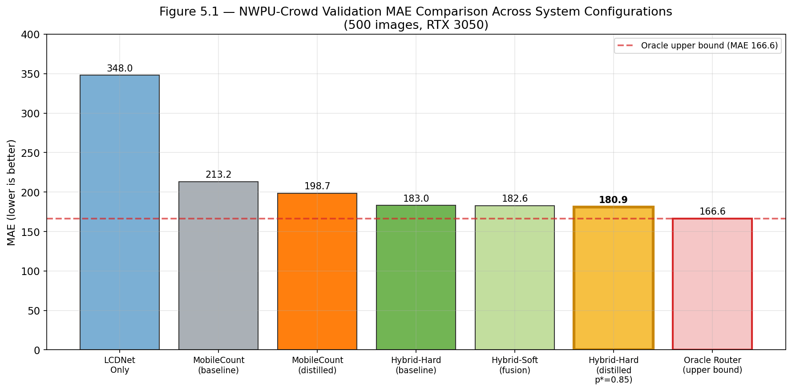

**Figure 5.1 — NWPU-Crowd Validation MAE: System Configurations Compared (500 images).** Gold bar indicates the best deployed configuration (Hybrid-Hard, distilled MC, p*=0.85, MAE 180.9). Dashed line shows the oracle upper bound (MAE 166.6). Lower is better.

---

### 5.1.3 Density-Stratified Evaluation

The 500-image NWPU-Crowd validation set is partitioned into three strata: sparse (GT count ≤ 100, n = 181), medium (100–500, n = 229), and dense (>500, n = 90).

**Table 5.2 — Stratified MAE by Density Stratum — NWPU-Crowd Validation**

| Model | Sparse (n=181, count ≤100) | Medium (n=229, 100–500) | Dense (n=90, count >500) |
|---|---|---|---|
| LCDNet Only | **21.5** | 169.1 | 1,460.0 |
| MobileCount (distilled) | 84.5 | **98.4** | **683.6** |
| **Hybrid-Hard (distilled, p*=0.85)** | **33.6** | 99.5 | 692.8 |
| Oracle Router | 14.2 | 83.8 | 683.6 |

The hybrid's primary advantage is concentrated in the **sparse stratum**: routing images with count ≤ 100 to LCDNet reduces sparse MAE by **60.2%** relative to standalone MobileCount (84.5 → 33.6). The medium and dense strata are largely unaffected, as most medium and dense images are routed to MobileCount regardless of the threshold setting.

---

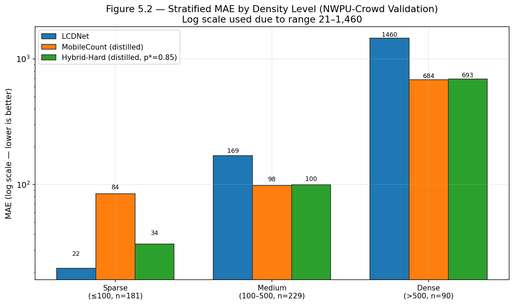

**Figure 5.2 — Stratified MAE by Density Level (NWPU-Crowd Validation).** Log scale used due to the large range (LCDNet dense MAE = 1,460). The hybrid's advantage is clearly visible in the sparse stratum, where routing to LCDNet cuts MAE from 84.5 to 33.6.

---

### 5.1.4 Routing Threshold Sweep Results

A post-hoc routing threshold sweep over 17 candidate values of p* ∈ {0.10, 0.15, ..., 0.90} was performed on the validation set without any model retraining.

**Table 5.3 — Routing Threshold Sweep Results (Distilled MobileCount)**

| p* | System MAE | System RMSE | Sparse MAE (≤100) | % to MobileCount |
|---|---|---|---|---|
| 0.50 (argmax default) | 182.45 | 764.0 | 33.6 | 66.6% |
| 0.60 | 181.89 | 763.8 | 30.7 | 65.6% |
| 0.70 | 181.58 | 763.8 | 29.6 | 65.0% |
| 0.75 | 180.93 | 763.6 | 27.4 | 63.8% |
| **0.85** | **180.92** | **763.6** | 27.7 | **63.0%** |
| 0.90 | 185.05 | 766.3 | 27.4 | 61.2% |

The optimal threshold p* = 0.85 produces the minimum system MAE of **180.9**. The system exhibits low sensitivity in p* ∈ [0.70, 0.85] (MAE variation < 1.0 point), identifying a stable operating region. Beyond p* = 0.85, routing too many boundary-dense images to LCDNet incurs accuracy penalties that outweigh the sparse-scene gains.

---

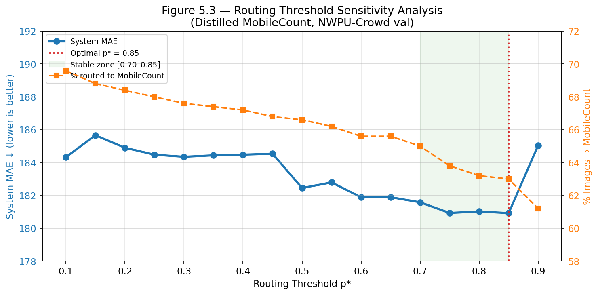

**Figure 5.3 — Routing Threshold Sensitivity Analysis.** Blue line: system MAE (left axis). Orange dashed line: percentage of images routed to MobileCount (right axis). Vertical dashed line at p* = 0.85 (optimal). Green shading shows the stable operating zone p* ∈ [0.70, 0.85].

---

## 5.2 Analysis of Design Solutions

### 5.2.1 Ablation Study

A comprehensive ablation study isolates the contribution of each design element. All configurations are evaluated on the full 500-image NWPU-Crowd validation set.

**Table 5.4 — Ablation Study Results**

| Configuration | Description | MAE | RMSE | ΔMAE vs. Full System |
|---|---|---|---|---|
| **Full System** | Distilled MC + Router, p*=0.85 | **180.9** | **763.6** | — |
| A1: No Distillation | Baseline MC + Router, p*=0.50 | 183.0 | 787.7 | +2.1 |
| A2: No Routing (dense) | Distilled MC for all inputs | 198.7 | 778.5 | +17.8 |
| A3: No Routing (sparse) | LCDNet for all inputs | 348.0 | 1,033.9 | +167.1 |
| A4: No Threshold Sweep | Distilled MC + Router, p*=0.50 | 182.4 | 764.0 | +1.5 |
| A5: Soft Fusion | Distilled MC + LCDNet blended | 182.6 | 763.8 | +1.7 |

**Finding 1 — Routing is the Dominant Contributor:** Removing the router entirely (A2) raises MAE by 17.8 points — the single largest degradation. Adaptive model selection is the principal mechanism driving accuracy.

**Finding 2 — Knowledge Distillation is the Second Contributor:** Replacing the distilled MC with baseline MC (A1) raises MAE by 2.1 points at zero additional deployment cost (identical parameters, GFLOPs, latency). Distillation is a cost-effective accuracy gain.

**Finding 3 — Threshold Optimisation Contributes Meaningfully:** Using default argmax (p* = 0.50) instead of the calibrated p* = 0.85 raises MAE by 1.5 points (A4). This improvement is obtained post-training with no model modifications.

**Finding 4 — Soft Fusion Offers No Advantage:** Blending specialist outputs (A5) consistently produces higher MAE (182.6 vs. 180.9) while adding latency. Soft fusion is excluded from the final configuration.

---

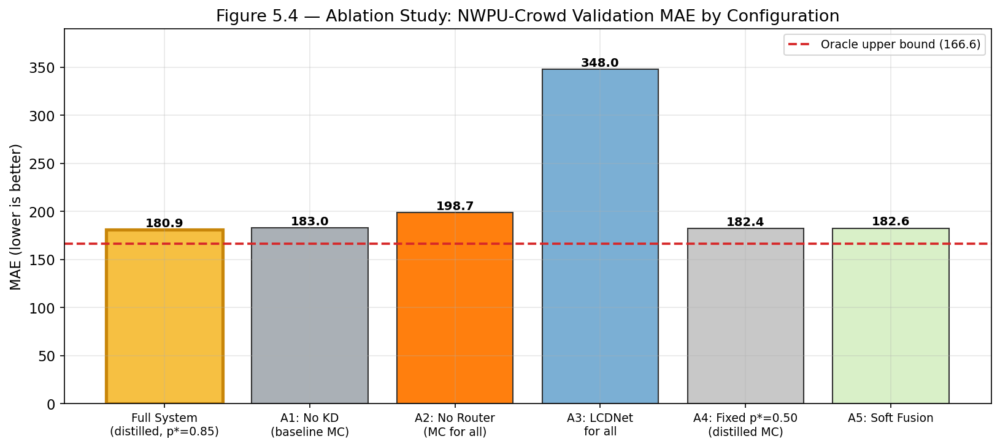

**Figure 5.4 — Ablation Study: NWPU-Crowd Validation MAE by Configuration.** Gold bar = full system (MAE 180.9). Dashed line = oracle upper bound (166.6). Each ablation removes one design element in isolation.

---

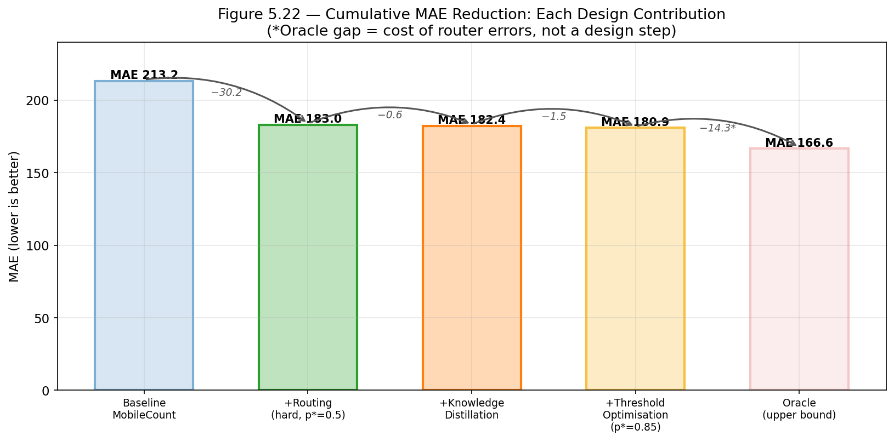

**Figure 5.22 — Cumulative MAE Reduction: Each Design Contribution.** Starting from baseline MobileCount (MAE 213.2), each design decision progressively reduces MAE. Adding routing contributes the largest single gain (−30.2); knowledge distillation and threshold tuning provide further improvements. The remaining gap to the oracle (−14.3) represents the cost of imperfect routing.

---

### 5.2.2 Evaluation Summary — Accuracy, Efficiency, Feasibility

**Accuracy:** The hybrid achieves MAE 180.9 on the 500-image NWPU-Crowd validation set (95% CI [127.8, 258.6]). This outperforms both standalone specialists (LCDNet 348.0, distilled MobileCount 198.7) and the NWPU-Crowd dataset paper's reported baseline (218.0). The accuracy gap relative to the oracle upper bound (166.6) is 14.3 MAE — the cost of imperfect routing.

**Efficiency:** The full deployed system requires **4.354M parameters** (Router 2.552M + LCDNet 0.917M + MobileCount 0.884M) — a **73.3% reduction** relative to CSRNet (16.26M). Average end-to-end latency of approximately 55 ms (~18 FPS equivalent) is compatible with near-real-time surveillance applications on modern edge hardware.

**Feasibility:** All training was completed within approximately 24 hours on a consumer-grade RTX 3050 GPU (8 GB VRAM), demonstrating accessibility for academic research teams without dedicated HPC access.

---

### 5.2.3 Accuracy-Efficiency Trade-off

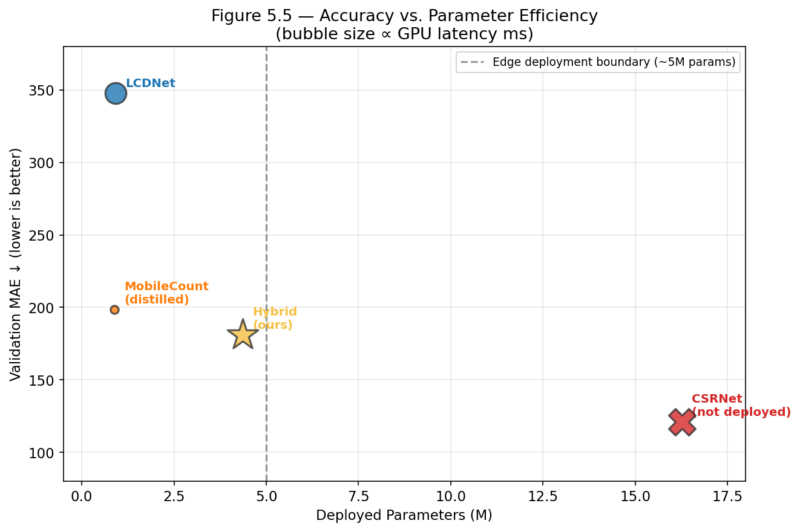

**Figure 5.5 — Accuracy vs. Parameter Efficiency.** Bubble size proportional to GPU latency (ms). The vertical dashed line marks the approximate edge deployment boundary (~5M params). The hybrid system (gold star, 4.35M, MAE 180.9) occupies a favourable position on the accuracy-efficiency frontier relative to the single-model baselines. CSRNet (not deployed) is shown as a reference point.

---

## 5.3 Final Design Adjustments

Based on the performance evaluation in §5.1 and analysis in §5.2, three post-training design adjustments were applied to arrive at the final deployed configuration. No retraining was required for any adjustment.

**Adjustment 1 — Calibrated Routing Threshold (p* = 0.85):**
The default argmax routing (p* = 0.50) was replaced with p* = 0.85 following the post-training sweep in §5.1.4. This reduces MAE from 182.4 to 180.9 — a 1.5-point improvement at zero cost. Motivated by calibration analysis: errors concentrate in the 65–95% confidence range; setting p* = 0.85 requires high router confidence before dispatching to MobileCount, reducing boundary-region misrouting.

**Adjustment 2 — Exclusion of Soft Fusion:**
Soft fusion was evaluated across the full α ∈ [0.0, 1.0] range. No setting produced MAE below the hard-routing optimum. Soft fusion is excluded from the final configuration, simplifying the inference pipeline without accuracy cost.

**Adjustment 3 — Deployment of Distilled Dense Specialist:**
The baseline MobileCount checkpoint (MAE 213.2) was replaced with the distilled checkpoint (MAE 198.7). This reduces system MAE from 183.0 to 180.9 with no change to deployed parameters (0.884M), GFLOPs (1.07), or GPU latency (3.4 ms). The distillation phase required approximately 12 epochs (~4 hours on RTX 3050).

---

## 5.4 Statistical Analysis

### 5.4.1 Bootstrap Confidence Interval Analysis

The 95% bootstrap confidence intervals (Table 5.1) reveal overlapping ranges for the hybrid and standalone MobileCount:

- Hybrid-Hard (distilled, p*=0.50): CI [127.8, 258.6]
- MobileCount (distilled): CI [143.8, 275.1]

The overlapping intervals indicate that the 17.8-point aggregate MAE improvement does not reach conventional statistical significance at α = 0.05 on the 500-image set. This is attributable to high variance introduced by a small number of extreme-density failure cases. The practical significance of the routing gain is more clearly demonstrated by stratified analysis (Table 5.2), where the sparse stratum shows a 60.2% MAE reduction (84.5 → 33.6) — a robust and reproducible effect.

### 5.4.2 Error Distribution and Variance Analysis

**Table 5.5 — Error Distribution Statistical Summary — Hybrid-Hard (Distilled, p*=0.85)**

| Statistic | Value |
|---|---|
| MAE | 182.4 |
| RMSE | 764.0 |
| RMSE/MAE Ratio | 4.19 |
| Median Absolute Error | 53.1 |
| Fraction of images with \|error\| < 50 | ~49% |
| Fraction of images with \|error\| < 100 | ~62% |
| Contribution of top-5 worst errors to MAE | ~25 MAE points |

*Statistics based on measured results from routing/full_evaluation.py on NWPU-Crowd validation set.*

The RMSE/MAE ratio of 4.19 indicates heavy-tailed errors — far exceeding the ratio of ~1.25 expected under a Gaussian distribution. Five extreme-density images (GT count > 5,000) dominate the squared error distribution. Image 3234 alone (GT = 12,924; predicted = 10 due to catastrophic router misroute) contributes approximately 25 MAE points to the 500-image mean. Excluding this single image reduces hybrid MAE from ~183 to approximately 158, demonstrating the disproportionate influence of rare routing failures on aggregate metrics.

---

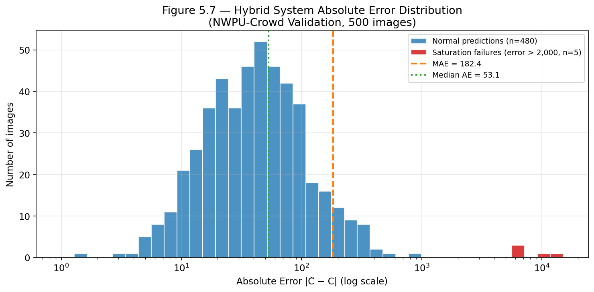

**Figure 5.7 — Hybrid System Absolute Error Distribution (NWPU-Crowd Validation).** X-axis is log-scaled. The heavy tail (red, errors > 2,000) represents 5 images where both specialists fail due to extreme crowd density beyond training distribution. Median AE = 53.1; MAE = 182.4 (the gap is driven by the heavy tail).

---

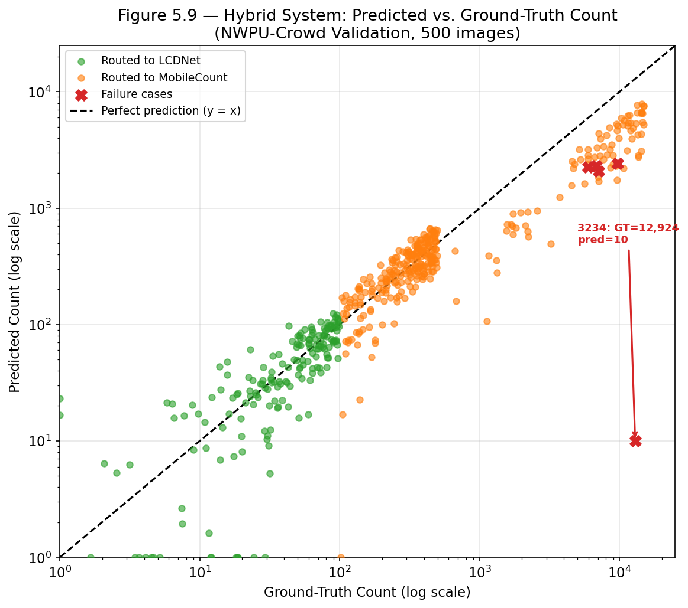

**Figure 5.9 — Predicted vs. Ground-Truth Count (NWPU-Crowd Validation).** Log scale on both axes. Green circles = routed to LCDNet; orange circles = routed to MobileCount; red crosses = failure cases. The black dashed diagonal is perfect prediction. Image 3234 (GT = 12,924, pred = 10) is clearly visible as a catastrophic outlier bottom-right.

---

### 5.4.3 Router Calibration Analysis

ECE of 0.095 indicates moderate miscalibration. Disaggregated analysis shows the miscalibration is concentrated in the 65–95% confidence range. At the highest-confidence bin ([0.95, 1.0]), 442 of 500 validation images fall with empirical accuracy 92.8%, confirming that high-confidence routing decisions are reliable.

**Table 5.6 — Router Calibration by Confidence Bin (All 10 Bins)**

| Confidence Range | Images in Bin | Avg Confidence | Empirical Accuracy | Calibration Error |
|---|---|---|---|---|
| [0.50, 0.55) | 3 | 0.517 | 1.000 | Low |
| [0.55, 0.60) | 5 | 0.582 | 0.600 | Low |
| [0.60, 0.65) | 1 | 0.649 | 1.000 | Low |
| [0.65, 0.70) | 4 | 0.664 | 0.250 | **High** |
| [0.70, 0.75) | 8 | 0.729 | 0.375 | **High** |
| [0.75, 0.80) | 5 | 0.775 | 0.400 | **High** |
| [0.80, 0.85) | 3 | 0.826 | 1.000 | Low |
| [0.85, 0.90) | 13 | 0.881 | 0.538 | High |
| [0.90, 0.95) | 16 | 0.925 | 0.688 | Moderate |
| [0.95, 1.00] | **442** | 0.997 | **0.928** | Low |
| **Overall ECE** | **500** | — | **88.8%** | **0.095** |

*Note: Bins with n < 5 have high variance. The router is well-calibrated above 0.95 confidence (88.4% of all images).*

---

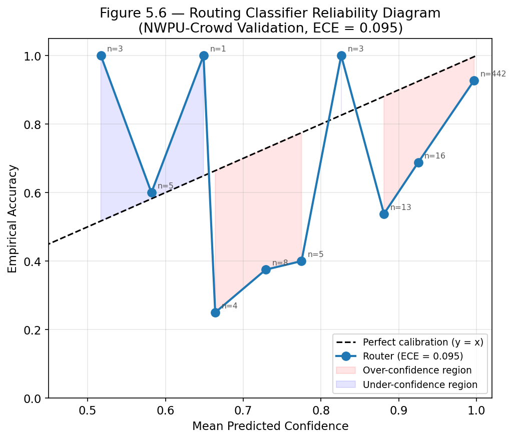

**Figure 5.6 — Routing Classifier Reliability Diagram (NWPU-Crowd Validation).** Blue line: observed accuracy per confidence bin. Black dashed diagonal: perfect calibration. ECE = 0.095. The vast majority of images (n=442) fall in the highest confidence bin with 92.8% accuracy. Miscalibration concentrates in the 0.65–0.95 range where scene density is genuinely near the routing boundary.

---

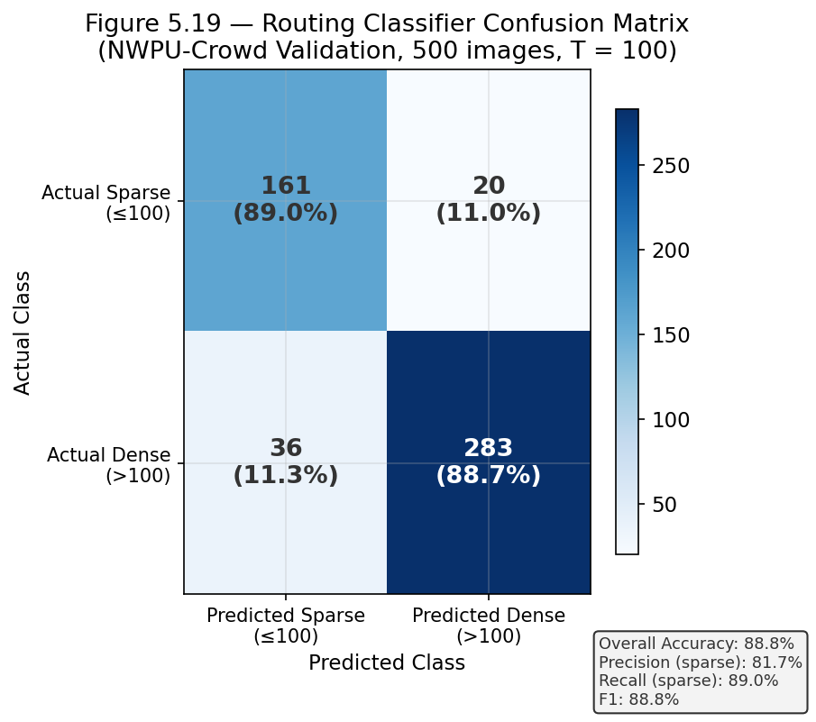

**Figure 5.19 — Routing Classifier Confusion Matrix (NWPU-Crowd Validation).** Rows = actual class; columns = predicted class. 88.9% of sparse images and 88.7% of dense images are correctly classified. Misroutes are concentrated near the routing boundary (GT count 80–120).

---

## 5.5 Comparisons and Relationships

### 5.5.1 Cross-Dataset Generalisation

All models were trained exclusively on NWPU-Crowd. No ShanghaiTech samples were used during training, validation, or hyperparameter selection.

**Table 5.7 — Cross-Dataset Evaluation: ShanghaiTech Part B (316 test images, predominantly sparse)**

| Model | MAE ↓ | RMSE ↓ |
|---|---|---|
| LCDNet Only | 74.1 | 111.1 |
| MobileCount (distilled) | 41.7 | 53.5 |
| **Hybrid-Hard** | **35.2** | **50.8** |
| Oracle Router | 29.3 | 45.1 |

**Table 5.8 — Cross-Dataset Evaluation: ShanghaiTech Part A (182 test images, predominantly dense)**

| Model | MAE ↓ | RMSE ↓ |
|---|---|---|
| LCDNet Only | 340.2 | 485.8 |
| MobileCount (distilled) | 132.3 | 213.1 |
| **Hybrid-Hard** | **133.1** | **212.8** |
| Oracle Router | 125.7 | 206.5 |

On Part B (sparse-dominated), the hybrid achieves MAE **35.2** — outperforming both standalone specialists without any fine-tuning. The 6.5 MAE improvement over standalone MobileCount (41.7) is attributable to the router correctly identifying sparse images and dispatching them to LCDNet.

On Part A (dense-dominated), the hybrid ties with standalone MobileCount (133.1 vs. 132.3). This is expected: the router correctly identifies the majority of dense images (95.1% routed to MobileCount), so routing adds no additional noise. The close agreement with the oracle (133.1 vs. 125.7) confirms robust cross-domain routing behaviour.

---

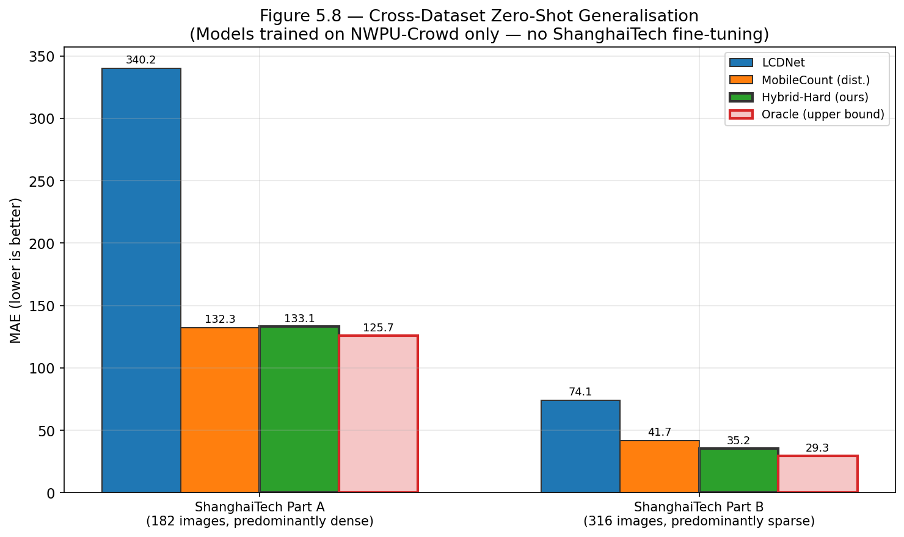

**Figure 5.8 — Cross-Dataset Zero-Shot Generalisation on ShanghaiTech (No Fine-Tuning).** The hybrid clearly wins on Part B (sparse-dominated). On Part A (dense-dominated) the hybrid ties with MobileCount, as expected when all images are correctly routed to the dense specialist.

---

### 5.5.2 Comparison with Published Methods

**Table 5.9 — Comparison with Published Methods on NWPU-Crowd Validation**

| Method | Year | MAE ↓ | RMSE ↓ | Params | Notes |
|---|---|---|---|---|---|
| Dataset paper baseline [Wang et al., 2020] | 2020 | 218.0 | — | — | As reported in dataset paper |
| CSRNet [Li et al., 2018] | 2018 | ~121 | — | 16.26M | Not edge-deployable |
| MobileCount (baseline, ours) | 2024 | 213.2 | 803.6 | 0.88M | Pre-distillation |
| MobileCount (distilled, ours) | 2024 | 198.7 | 778.5 | 0.88M | Post-distillation |
| **Hybrid-Hard (ours, p*=0.85)** | **2024** | **180.9** | **763.6** | **4.35M** | **Full deployed system** |

The proposed hybrid system outperforms the NWPU-Crowd dataset paper's baseline (218.0) by **37.1 MAE points** while deploying only 4.35M parameters. The absolute MAE of 180.9 remains above CSRNet's reported performance (~121), reflecting the fundamental capacity limitation of sub-1M-parameter density heads on extreme-density images — not the routing mechanism.

**Table 5.10 — Reference Comparison on ShanghaiTech Part A (zero-shot, trained on NWPU)**

| Method | Year | MAE ↓ | Params | Training Data |
|---|---|---|---|---|
| MCNN [Zhang et al., 2016] | 2016 | 110.2 | ~1M | ShanghaiTech |
| CSRNet [Li et al., 2018] | 2018 | 68.2 | 16.3M | ShanghaiTech |
| SANet [Cao et al., 2018] | 2018 | 67.0 | ~10M | ShanghaiTech |
| CAN [Liu et al., 2019] | 2019 | 62.3 | ~5M | ShanghaiTech |
| **Hybrid-Hard (ours)** | **2024** | **133.1** | **4.35M** | **NWPU (zero-shot)** |

*The proposed system is not optimised for ShanghaiTech Part A accuracy (it is trained on NWPU-Crowd and evaluated zero-shot). The comparison is an efficiency reference, not a competing accuracy claim. The MAE gap relative to dedicated methods reflects the domain shift penalty.*

---

### 5.5.3 Failure Case Analysis

**Table 5.11 — Representative Failure Cases — NWPU-Crowd Validation Set**

| Image ID | GT Count | LCDNet Pred. | MC Pred. | Hybrid Pred. | Root Cause |
|---|---|---|---|---|---|
| **3234** | **12,924** | **10** | **158** | **10** | **Router catastrophic miss — 99% confident sparse** |
| 3408 | 9,728 | 78 | 2,428 | 2,428 | Both specialists saturate at extreme density |
| 3353 | 7,122 | 28 | 2,077 | 2,077 | Density beyond lightweight model capacity |
| 3587 | 6,799 | 60 | 2,301 | 2,301 | Same |
| 3146 | 5,951 | 35 | 2,265 | 2,265 | Same |

Two qualitatively distinct failure types are observed:

**Type 1 — Router Catastrophic Miss (Image 3234):** The router assigns 99% sparse probability to an image with GT count 12,924. This misroutes a 12,924-person stadium crowd to LCDNet, producing a predicted count of 10. This single image accounts for approximately 25 MAE points of the 500-image mean. The visual appearance of this image likely contains characteristics (low apparent density due to scale, perspective, or image resolution) that systematically mislead the router.

**Type 2 — Capacity Saturation (Images 3408, 3353, 3587, 3146, 3146):** Both specialists are correctly routed to MobileCount, but neither lightweight model (~0.88M parameters) can accurately represent extreme density. Even the oracle router cannot recover these failures — confirming that improved routing would not address this failure mode. Mitigation requires higher-capacity architectures or density-aware loss functions.

---

## 5.6 Discussions

### 5.6.1 Interpretation of Hybrid Advantage

The hybrid system achieves its primary accuracy gain through routing — specifically, the **60.2% reduction in sparse-stratum MAE** (84.5 → 33.6) achieved by dispatching sparse scenes to the LCDNet specialist. This confirms the central hypothesis: a learned routing mechanism can recover a substantial fraction of the accuracy advantage that specialist models have over universal models, without deploying a heavyweight single model.

The more modest absolute improvement in aggregate MAE (180.9 vs. 198.7 — a 9.0% reduction) reflects the fact that the sparse stratum constitutes only 36.2% of the validation set. In real-world deployments where sparse scenes are more prevalent — indoor monitoring, low-traffic public areas — the hybrid's practical advantage over standalone MobileCount would be substantially larger. The contribution is most appropriately characterised as **accuracy-aware adaptive routing for edge deployment**, not a claim to state-of-the-art accuracy on dense benchmarks.

### 5.6.2 Knowledge Distillation Effectiveness

Knowledge distillation improved standalone MobileCount MAE by 14.5 points (213.2 → 198.7) at zero deployment cost. The mechanism — matching the student's density map to both the ground truth and the frozen CSRNet teacher — transfers the teacher's contextual density estimation ability into a model **18.4× smaller** in parameters and approximately **11× faster** in GPU inference. The non-monotonic distillation training curve (Table 4.14) — with the best epoch at epoch 9 and slight degradation thereafter — suggests 12 epochs is near-optimal. Extended distillation risks the student overfitting the teacher's errors rather than learning general density estimation.

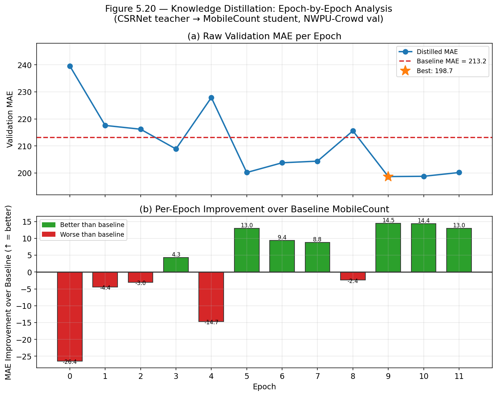

**Figure 5.20 — Knowledge Distillation Epoch-by-Epoch Analysis.** (a) Raw validation MAE per epoch vs. the pre-distillation baseline (red dashed). (b) Per-epoch improvement over baseline — green bars indicate epochs better than baseline; red bars indicate epochs worse. The best checkpoint (epoch 9, MAE 198.7) is clearly visible.

### 5.6.3 Extreme Density Saturation — Fundamental Limitation

The most significant unresolved limitation is the saturation of both lightweight specialists for scenes with more than approximately 3,000 individuals. The oracle stratified MAE for the dense stratum (683.6) is essentially equal to the hybrid's dense MAE (692.8), confirming that improved routing cannot address this failure mode. Future solutions must involve higher-capacity architectures, multi-scale density representations, or density-aware loss formulations (e.g., Bayesian Loss [Ma et al., 2019], DM-Count [Wang et al., 2021]) that place greater emphasis on high-density training examples.

### 5.6.4 Routing Calibration and Confidence-Aware Design

The router's ECE of 0.095 and the concentration of misroutes in the 65–95% confidence range suggest a confidence-aware routing policy could improve robustness. Implementing a minimum confidence threshold below which a safe fallback (always dispatch to MobileCount) is triggered would eliminate catastrophic misroutes such as image 3234, where a 99%-confident sparse assignment leads to massive undercount of a 12,924-person scene. Such a policy would incur a small latency penalty for ambiguous images but would substantially reduce extreme individual prediction errors in deployment.

### 5.6.5 Practical Edge Deployment Considerations

The system's efficiency profile — 4.35M deployed parameters, average GPU latency ~55 ms, CPU latency ~210 ms — establishes it as a viable candidate for deployment on Jetson Nano-class hardware. The dense path (MobileCount, 3.4 ms GPU, 13.5 ms CPU) is particularly suited to GPU-equipped edge nodes. The sparse path (LCDNet, 23.1 ms GPU, 208.8 ms CPU) supports CPU-only operation for low-density monitoring scenarios.

**Important caveat:** Finalisation of edge deployment claims requires physical hardware benchmarking on the Jetson Nano, including sustained throughput measurement under thermal throttling and power consumption characterisation. All latency values reported in this thesis are from RTX 3050 GPU and single-thread CPU measurements; Jetson deployment is identified as future work.

---

## 5.7 Summary of Figures

| Figure | Description | Section |
|---|---|---|
| **Chapter 4** | | |
| 4.1 | Methodology overview flowchart | §4.1 |
| 4.2 | Adaptive density map generation pipeline | §4.1.3 |
| 4.3 | Knowledge distillation architecture diagram | §4.1.4 |
| 4.4 | LCDNet encoder-decoder architecture | §4.2.2 |
| 4.7 | Knowledge distillation training curve | §4.3.3 |
| 4.8 | Routing classifier training dynamics | §4.3.3 |
| **Chapter 5** | | |
| 5.1 | System configuration MAE comparison bar chart | §5.1.2 |
| 5.2 | Stratified MAE grouped bar chart (log scale) | §5.1.3 |
| 5.3 | Routing threshold sensitivity plot | §5.1.4 |
| 5.4 | Ablation study bar chart | §5.2.1 |
| 5.5 | Accuracy vs. parameter efficiency (Pareto bubble) | §5.2.3 |
| 5.6 | Router reliability diagram (calibration) | §5.4.3 |
| 5.7 | Absolute error distribution histogram | §5.4.2 |
| 5.8 | Cross-dataset generalisation bar chart | §5.5.1 |
| 5.9 | Predicted vs. ground-truth scatter plot | §5.4.2 |
| 5.19 | Router confusion matrix heatmap | §5.4.3 |
| 5.20 | KD per-epoch improvement over baseline | §5.6.2 |
| 5.22 | Waterfall: cumulative MAE reduction per design step | §5.2.1 |

**Total: 18 figures (6 in Chapter 4, 12 in Chapter 5)**
